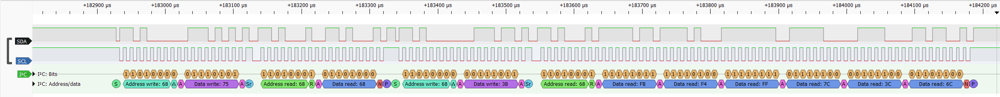

# I2C Validation Framework (MPU6050)

## Overview

End-to-end validation framework for MPU6050 I2C communication using a
Freenove Control Board V5 Rev4 Mini DUT and a Python host test harness. This project demonstrates
hardware/software integration, automated DUT validation, fault injection,
and real timing analysis with a signal analyzer.

### What I built

- Python host automation for serial command delivery and result logging
- Arduino IDE-compatible firmware for I2C register access, burst reads, and error handling
- PASS/FAIL validation logic with structured CSV reporting
- I2C timing analysis for 100 kHz and 400 kHz bus configurations

### Key results

- Verified MPU6050 operation at nominal 100 kHz
- Measured ~519 kHz average bus frequency for `Wire.setClock(400000)` on the Freenove Control Board V5 Rev4 Mini
- Identified Renesas IIC register timing behavior behind the fast-mode discrepancy
- Confirmed MPU6050 tolerated the measured higher-frequency waveform

------------------------------------------------------------------------

## Features

-   Serial command protocol between Python host and Arduino-compatible DUT
-   I2C register access and burst reads
-   Automated PASS/FAIL evaluation logic
-   Structured CSV logging
-   Fault injection support (e.g. bad address, corrupted data)
-   Tools: Python, Arduino, I2C, serial protocol, PulseView logic analysis

------------------------------------------------------------------------

## Architecture

```text
Python Host
   |
   | Serial
   v
Freenove Control Board V5 Rev4 Mini (DUT)
   |
   | I2C
   v
MPU6050 Sensor
```
------------------------------------------------------------------------
## Components

- Freenove Control Board V5 Rev4 Mini (Arduino IDE-compatible)
- MPU6050
- Logic Analyzer (PulseView)
- Jumper wires
- 5 kohm resistors

------------------------------------------------------------------------

## Hardware Setup

- MPU6050 connected to the Freenove Control Board V5 Rev4 Mini:
  - VCC -> 3.3V (Freenove control board)
  - GND -> GND (Freenove control board)
  - SDA -> SDA (Freenove control board)
  - SCL -> SCL (Freenove control board)

- Pull-up resistors (~5 kohm) used on SDA and SCL to 3.3V
------------------------------------------------------------------------
## I2C Timing Validation

The I2C bus was tested at multiple configured speeds using the Freenove Control Board V5 Rev4 Mini hardware IIC peripheral on SDA/SCL.

| Configured Speed | Measured Average Frequency |
|------------------|----------------------------|
| 100 kHz          | ~100 kHz                   |
| 400 kHz          | ~519 kHz average           |

### Key Finding
- 100 kHz matched the expected frequency.
- 400 kHz measured above the nominal fast-mode target.
- The 400 kHz result is explained by the Arduino Renesas Wire core register settings, not by the SCI I2C baud-rate formula.

### Analysis (Detailed) 

The Arduino-compatible `Wire` object on SDA/SCL uses the RA4M1 hardware IIC peripheral, not the SCI I2C peripheral. The timing is therefore based on the IIC registers:

- ICBRL: SCL low-level period register
- ICBRH: SCL high-level period register
- ICMR1.CKS: IIC clock divider select
- ICFER.SCLE: SCL synchronous circuit enable
- ICFER.NFE: digital noise filter enable
- ICMR3.NF: noise filter stage select

The board diagnostics showed:

```text
PCLKB = 24 MHz
BSP_FEATURE_SCI_CLOCK = 48 MHz
SCLE = 1
NFE = 1
NF = 0
```

For this IIC timing formula, the relevant clock source is PCLKB. The 48 MHz SCI clock is not used for the SDA/SCL hardware IIC register timing.

With SCLE = 1, NFE = 1, and NF = 0:

```text
nf = NF + 1 = 1
high_cycles = ICBRH + 3 + nf
low_cycles  = ICBRL + 3 + nf
iic_clock   = PCLKB / 2^CKS
rate        = 1 / ((high_cycles + low_cycles) / iic_clock + tr + tf)
```

Where `tr` is SCL rise time and `tf` is SCL fall time. These edge times are affected by pull-up resistance, bus capacitance, wiring, and the measurement threshold. This project used approximately 5 kohm pull-up resistors.

#### 100 kHz Setting

For `Wire.setClock(100000)`, the Arduino Renesas Wire core configured:

```text
ICBRL = 27
ICBRH = 26
CKS   = 2
```

Calculation:

```text
iic_clock = 24 MHz / 2^2 = 6 MHz
high_cycles = 26 + 3 + 1 = 30
low_cycles  = 27 + 3 + 1 = 31
total_cycles = 61

ideal period = 61 / 6 MHz = 10.17 us
ideal frequency = 98.4 kHz before tr/tf
```

This is close to the measured result of approximately 100 kHz.

#### 400 kHz Setting

For `Wire.setClock(400000)`, the Arduino Renesas Wire core configured:

```text
ICBRL = 16
ICBRH = 15
CKS   = 0
```

Calculation:

```text
iic_clock = 24 MHz / 2^0 = 24 MHz
high_cycles = 15 + 3 + 1 = 19
low_cycles  = 16 + 3 + 1 = 20
total_cycles = 39

ideal high = 19 / 24 MHz = 791.7 ns
ideal low  = 20 / 24 MHz = 833.3 ns
ideal period = 39 / 24 MHz = 1.625 us
ideal frequency = 615.4 kHz before tr/tf
```

Measured:

```text
HIGH ~= 1000 ns
LOW  ~= 875 ns
TOTAL ~= 1875 ns
frequency ~= 533 kHz
```

The measured frequency is lower than the register-only estimate because real bus rise and fall times add to the SCL period. This effect is small at 100 kHz because the period is about 10 us, but it is much more visible at the faster setting because the ideal period is only about 1.625 us.

### Validation Outcome
- System remains functional at the measured fast-mode frequency.
- The MPU6050 tolerated the measured clock rate above nominal 400 kHz.
- `Wire.setClock(400000)` on this Freenove control board setup does not produce a strict 400 kHz waveform; it produces a faster register configuration that measured about 519 kHz average in the latest capture, with cycle-level timing around 533 kHz.

## Project Structure

```
project_root/
|
|-- python_src/          # Python source code
|   |-- main.py          # Entry point
|   |-- serial_comm.py   # Serial communication
|   |-- logger.py        # CSV logging + test execution
|   |-- analyzer.py      # PASS/FAIL logic + analysis
|   `-- config.py        # Configuration (paths, constants)
|
|-- data/                # Sample timing CSVs and generated validation logs
|
|-- arduino_src/         # Arduino IDE-compatible firmware (DUT)
|   `-- mpu_driver/      # Arduino sketch source
|       `-- mpu_driver.ino
|
|-- assets/              # Screenshots
|   |-- csv_output.png
|   `-- i2c_waveform.png
|
`-- README.md
```

------------------------------------------------------------------------

## Commands

-   READ_WHOAMI
-   READ_ACCEL
-   READ_WHOAMI_BAD_ADDR
-   SET_I2C_100K
-   SET_I2C_400K
-   PRINT_I2C_DIAGNOSTICS

------------------------------------------------------------------------

## Example Output (Serial)

```text
OK:READ_WHOAMI:WHO_AM_I:104
OK:READ_ACCEL:ACCEL:-1240:-48:15344
ERR:READ_WHOAMI_BAD_ADDR:MPU_NOT_DETECTED
```

------------------------------------------------------------------------

## CSV Logging

Format: timestamp, result, command, status, device_command, test, x, y, z, raw

Example: 

['2026-04-04 17:39:40.805', 'PASS', 'READ_WHOAMI', 'OK',
'READ_WHOAMI', 'WHO_AM_I', '104', 'OK:READ_WHOAMI:WHO_AM_I:104']

['2026-04-04 17:39:40.914', 'PASS', 'READ_ACCEL', 'OK', 'READ_ACCEL', 'ACCEL',
'-928', '-176', '15168', 'OK:READ_ACCEL:ACCEL:-928:-176:15168']

['2026-04-04 17:39:41.023', 'PASS', 'READ_WHOAMI_BAD_ADDR', 'ERR',
'READ_WHOAMI_BAD_ADDR', 'MPU_NOT_DETECTED', 'ERR:READ_WHOAMI_BAD_ADDR:MPU_NOT_DETECTED']

------------------------------------------------------------------------

## Validation Logic

-   Responses parsed and evaluated in analyzer.py
-   PASS/FAIL based on expected values and thresholds
-   Handles error and timeout conditions

------------------------------------------------------------------------

## Data Handling

-   Logs saved in data/ directory
-   Paths resolved dynamically using __file__
-   Directories auto-created if missing


------------------------------------------------------------------------
## Example Output

### Terminal

```text
[TEST] READ_WHOAMI
Response: OK:READ_WHOAMI:WHO_AM_I:104
Result: PASS

[TEST] READ_ACCEL
Response: OK:READ_ACCEL:ACCEL:-1260:-208:15216
Result: PASS

[TEST] READ_WHOAMI_BAD_ADDR
Response: ERR:READ_WHOAMI_BAD_ADDR:MPU_NOT_DETECTED
Result: PASS

----------------------------------
PASS: 3
FAIL: 0

----------------------------------

Running I2C Timing Analysis on saved CSV files...

[100 kHz Test]
--- I2C Hardware Validation ---
File:            i2c_data_100khz.csv
Detected Unit:   Nanoseconds
Mean Frequency:  99.37 kHz
Min Frequency:   43.48 kHz
Max Frequency:   100.85 kHz
Total Pulses:    82

[400 kHz Test]
--- I2C Hardware Validation ---
File:            i2c_data_400khz.csv
Detected Unit:   Nanoseconds
Mean Frequency:  519.01 kHz
Min Frequency:   67.04 kHz
Max Frequency:   545.55 kHz
Total Pulses:    82

----------------------------------

[DIAGNOSTIC] 100 kHz
OK:SET_I2C_100K:CLK=100kHz
--- I2C diagnostics ---
Requested clock Hz: 100000
PCLKB Hz: 24000000
BSP_FEATURE_SCI_CLOCK Hz: 48000000
ICFER=0x77 SCLE=1 NFE=1
ICMR1=0x28 CKS=10b
ICMR3=0x0 NF=0
ICBRL=27 ICBRH=26
Formula case: SCLE=1, NFE=1, CKS=10b
Estimated high cycles: 30
Estimated low cycles: 31
Estimated total cycles before tr/tf: 61
IICphi Hz used for estimate: 24000000
IICphi divided by CKS Hz: 6000000
Base high ns before tr: 5000.00
Base low ns before tf: 5166.67
Base rate Hz before tr/tf: 98360.66
Use: rate = 1 / ((total_cycles / IICphi) + tr + tf)
-----------------------

[DIAGNOSTIC] 400 kHz
OK:SET_I2C_400K:CLK=400kHz
--- I2C diagnostics ---
Requested clock Hz: 400000
PCLKB Hz: 24000000
BSP_FEATURE_SCI_CLOCK Hz: 48000000
ICFER=0x77 SCLE=1 NFE=1
ICMR1=0x8 CKS=0b
ICMR3=0x0 NF=0
ICBRL=16 ICBRH=15
Formula case: SCLE=1, NFE=1, CKS=0b
Estimated high cycles: 19
Estimated low cycles: 20
Estimated total cycles before tr/tf: 39
IICphi Hz used for estimate: 24000000
IICphi divided by CKS Hz: 24000000
Base high ns before tr: 791.67
Base low ns before tf: 833.33
Base rate Hz before tr/tf: 615384.63
Use: rate = 1 / ((total_cycles / IICphi) + tr + tf)
```


### I2C Waveform (PulseView)
#### Accelerometer burst read, `Wire.setClock(400000)` configured, measured above 400 kHz


------------------------------------------------------------------------

## Notes

This project demonstrates practical validation engineering through real hardware testing:

- Built a Python-based test framework for host-to-DUT communication
- Validated I2C protocol behavior using register and burst reads
- Implemented automated PASS/FAIL evaluation based on expected sensor output
- Performed fault injection (invalid address) to verify error handling
- Analyzed real signal timing using a logic analyzer (PulseView)

------------------------------------------------------------------------

## Future Improvements

-   Batch test runner to support regression testing 
-   Summary report (PASS/FAIL stats)

------------------------------------------------------------------------

## References

- [RA4M1 Hardware Manual (IIC Section)](https://edm.eeworld.com.cn/ra4m1-Users_Manual_Hardware.pdf)
- [Arduino Renesas Core - Wire Implementation](https://github.com/arduino/ArduinoCore-renesas/blob/main/libraries/Wire/Wire.cpp#L540)
- [Renesas FSP - IIC Master Driver Documentation](https://renesas.github.io/fsp/group___i_i_c___m_a_s_t_e_r.html)
- [MPU-6050 Register Map and Descriptions](https://cdn.sparkfun.com/datasheets/Sensors/Accelerometers/RM-MPU-6000A.pdf)
- [MPU-6050 Datasheet (Product Specification)](https://product.tdk.com/system/files/dam/doc/product/sensor/mortion-inertial/imu/data_sheet/mpu-6000-datasheet1.pdf)

------------------------------------------------------------------------

## License

This project is licensed under the MIT License. See [LICENSE](LICENSE) for details.
