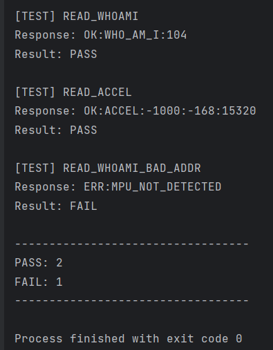
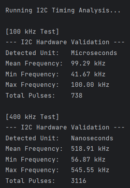
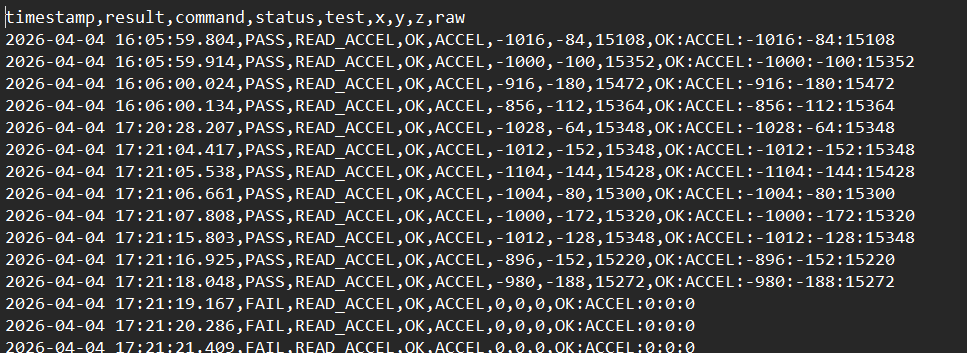

# I2C Validation Framework (MPU6050)

## Overview

Python-based validation framework for testing the MPU6050 sensor over
I2C using an Arduino as the device under test (DUT).

The system automates command execution, validates responses, and logs
structured results for analysis.

------------------------------------------------------------------------

## Features

-   Serial command protocol between Python host and Arduino DUT
-   I2C register access and burst reads
-   Automated PASS/FAIL evaluation logic
-   Structured CSV logging
-   Fault injection support (e.g. bad address, corrupted data)

------------------------------------------------------------------------

## Architecture

```text
Python Host
   │
   │ Serial
   ↓
Arduino (DUT)
   │
   │ I2C
   ↓
MPU6050 Sensor
```
------------------------------------------------------------------------
## Components

- Arduino Uno R4
- MPU6050
- Logic Analyzer (PulseView)
- Jumper wires
- 5kΩ Resistors

------------------------------------------------------------------------

## Hardware Setup

- MPU6050 connected via I2C:
  - VCC → 5V
  - GND → GND
  - SDA → SDA (Arduino)
  - SCL → SCL (Arduino)

- Pull-up resistors (~5kΩ) used on SDA and SCL
------------------------------------------------------------------------
## I2C Timing Validation

The I2C bus was tested at multiple configured speeds using the MCU's I2C peripheral.

| Configured Speed | Measured Average Frequency |
|------------------|----------------------------|
| 100 kHz          | ~100 kHz                   |
| 400 kHz          | ~519 kHz                   |

### Observations
- Standard mode (100 kHz) operates within expected range
- Fast mode (400 kHz) exceeds expected frequency
- Measured clock deviates due to hardware clock configuration (BRR/MDDR settings)

### Analysis
The discrepancy at 400 kHz suggests:
- Clock divisor rounding limitations in the MCU
- Possible bitrate modulation effects
- Peripheral configuration not achieving exact target frequency

### Validation Outcome
- System remains functional at measured frequency
- Device (MPU6050) tolerates higher clock rate
- Highlighted as a **timing deviation for further calibration**

## Project Structure

```
project_root/
│
├── python_src/                 # Python source code
│   ├── main.py          # Entry point
│   ├── serial_comm.py   # Serial communication
│   ├── logger.py        # CSV logging + test execution
│   ├── analyzer.py      # PASS/FAIL logic + analysis
│   └── config.py        # Configuration (paths, constants)
│
├── data/                # Generated CSV logs and pulse view csv files
│
├── arduino_src/         # Arduino firmware (DUT)
│   └── mpu6050_validation.ino
│
├── assets/              # Screenshots
│   ├── terminal_output.png
│   ├── csv_output.png
│   └── i2c_waveform.png
│
└── README.md
```

------------------------------------------------------------------------

## Commands

-   READ_WHOAMI
-   READ_ACCEL
-   READ_WHOAMI_BAD_ADDR

------------------------------------------------------------------------

## Example Output (Serial)

OK:WHO_AM_I:104 OK:ACCEL:-972:-52:15580 ERR:I2C_FAIL

------------------------------------------------------------------------

## CSV Logging

Format: timestamp, result, command, status, test, x, y, z, raw

Example: 

['2026-04-04 17:39:40.805', 'PASS', 'READ_WHOAMI', 'OK',
'WHO_AM_I', '104', 'OK:WHO_AM_I:104']

['2026-04-04 17:39:40.914', 'PASS', 'READ_ACCEL', 'OK', 'ACCEL',
'-928', '-176', '15168', 'OK:ACCEL:-928:-176:15168']

['2026-04-04 17:39:41.023', 'FAIL', 'READ_WHOAMI_BAD_ADDR', 'ERR',
'MPU_NOT_DETECTED', 'ERR:MPU_NOT_DETECTED']

------------------------------------------------------------------------

## Validation Logic

-   Responses parsed and evaluated in analyzer.py
-   PASS/FAIL based on expected values and thresholds
-   Handles error and timeout conditions

------------------------------------------------------------------------

## Data Handling

-   Logs saved in data/ directory
-   Paths resolved dynamically using __file__
-   Directories auto-created if missing


------------------------------------------------------------------------
## Example Output

### Terminal
#### Results of "READ_WHOAMI", "READ_ACCEL", "READ_WHOAMI_BAD_ADDR" 


#### i2c frequency analyze, 100khz and 400khz respectively  


### CSV Output
#### test_READ_ACCEL.csv


### I2C Waveform (PulseView)
#### Accelerometer burst read


------------------------------------------------------------------------

## Notes

This project demonstrates practical validation engineering through real hardware testing:

- Built a Python-based test framework for host-to-DUT communication
- Validated I2C protocol behavior using register and burst reads
- Implemented automated PASS/FAIL evaluation based on expected sensor output
- Performed fault injection (invalid address) to verify error handling
- Analyzed real signal timing using a logic analyzer (PulseView)

------------------------------------------------------------------------

## Future Improvements

-   Batch test runner to support regression testing 
-   Summary report (PASS/FAIL stats)
